# 第一节课 - 书生·浦语大模型全链路开源体系 - 笔记

1. 大模型的发展背景：大模型已成为发展通用人工智能的重要途径。从本世纪初至2021-2022年，研究主要集中在专用模型上，针对特定任务采用特定模型。然而，近两年趋势转向发展通用大模型，即一个模型应对多种任务和模态。

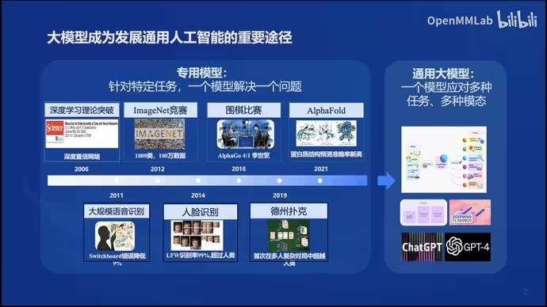

2. 书生浦语大模型的特点：书生浦语大模型是一个全链条的开源体系，支持长达20万汉字的输入，是全球大模型产品中支持的最长上下文输入长度。模型具备超长上下文能力、推理数学代码能力、对话和创作体验，以及工具调用能力。

3. 开源历程：书生浦语大模型自发布以来，经历了快速迭代。包括升级千亿参数大模型、支持8K语境、推出全免费商用的7B开源模型和全链条工具体系、发布多模态预训练语料库、升级对话模型等。

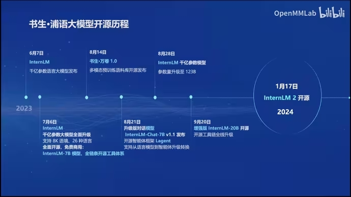

4. 回归语言建模的本质

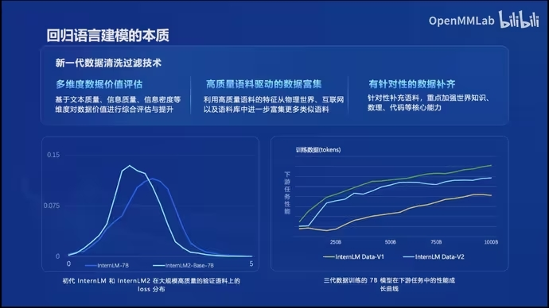

5. 书生浦语2.0的主要亮点

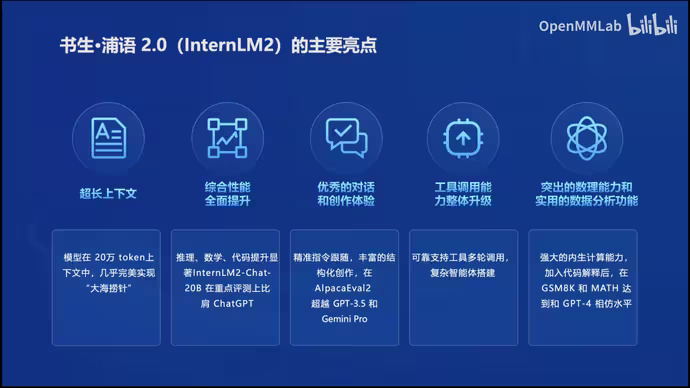
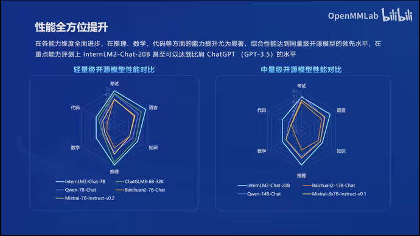

GSM8K和MATH是当前典型的数学评测集

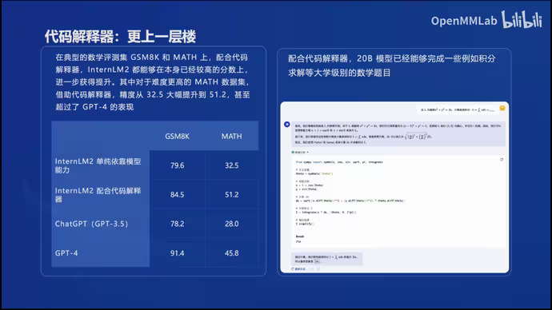

6. 从模型到应用

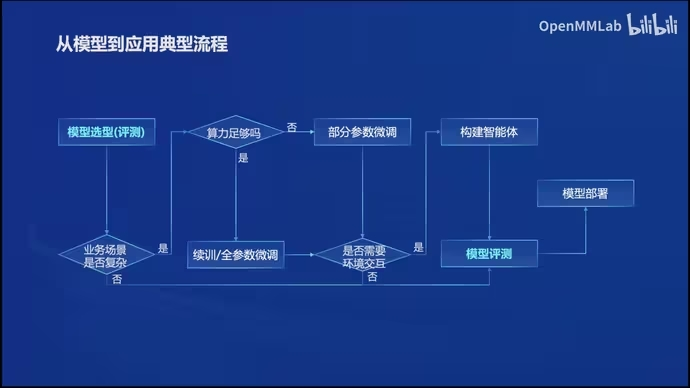

7. 工具体系：为了简化从模型到应用的过程，开发了全链条的工具体系并开源。这包括数据集、预训练框架、微调框架、部署解决方案、评测体系和智能体框架等。这些工具支持从数据准备、模型训练、微调、部署到评测的整个过程，旨在帮助开发者和研究者更容易地使用和开发大模型应用。

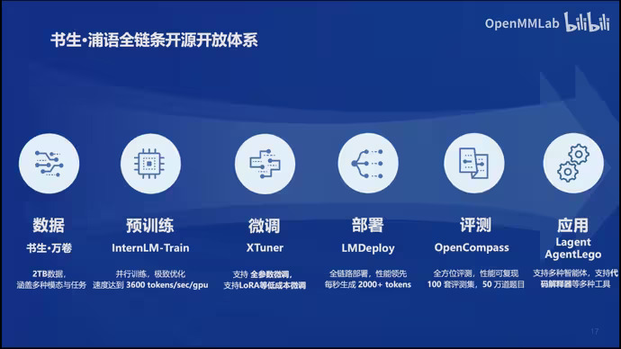
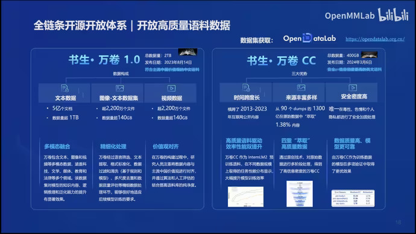

微调：增量续训、有监督微调

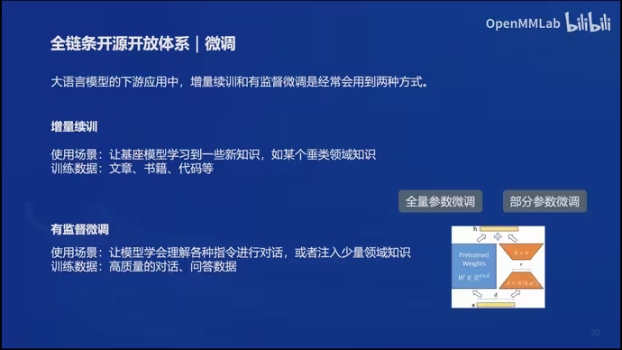

高效微调框架XTuner

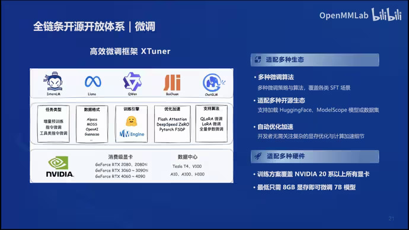

评测框架的开发和开源，OpenCompass

主流大模型的榜单

CompassKit工具链

CompassHub基准社区

头部企业在发布大模型时都会用OpenCompass进行评测，获得了Meta官方推荐，唯一国产大模型评测体系。

模型的部署：

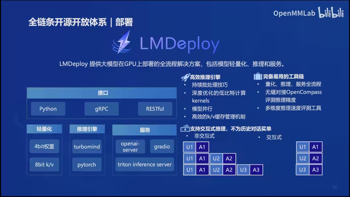

智能体框架：Lagent

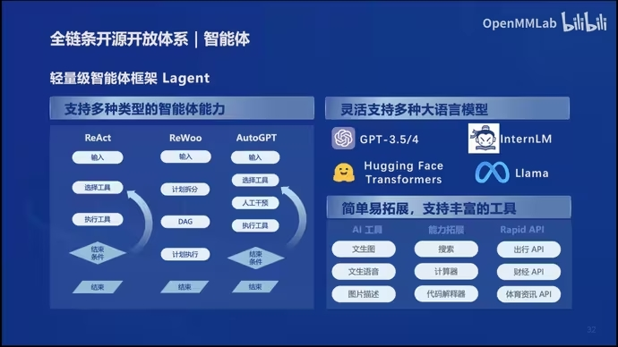

多模态智能体工具箱AgentLego

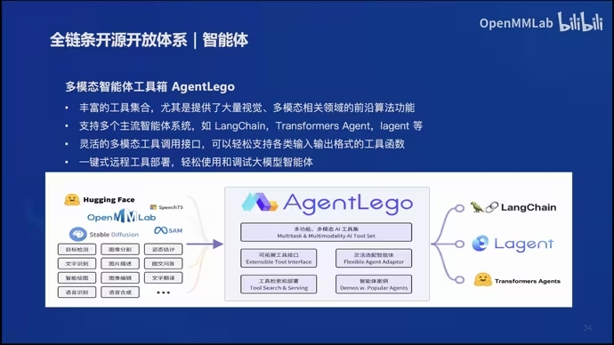
